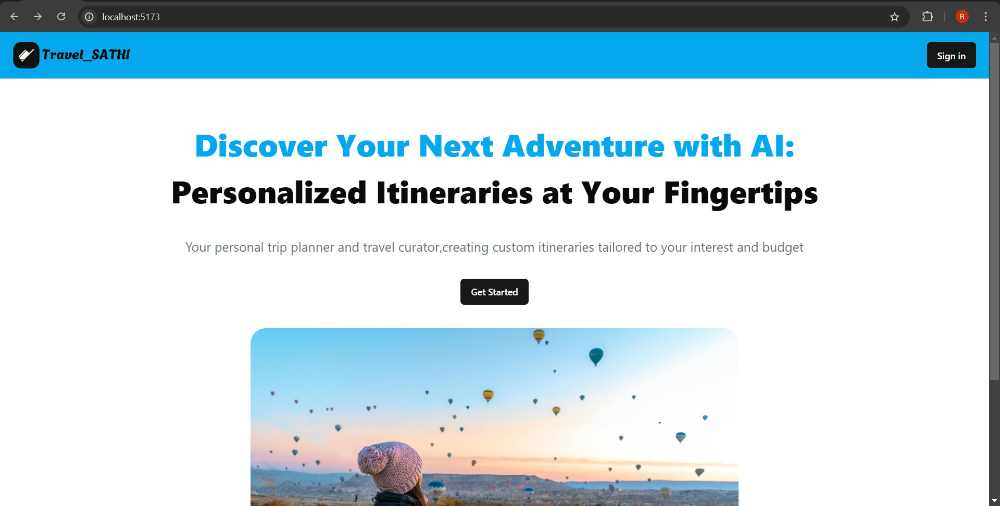
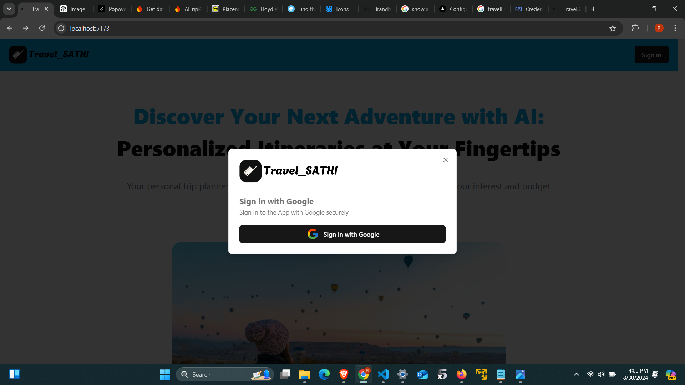
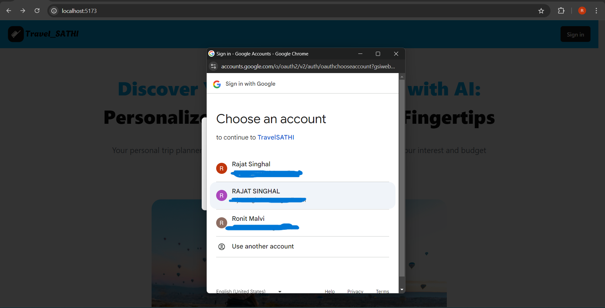
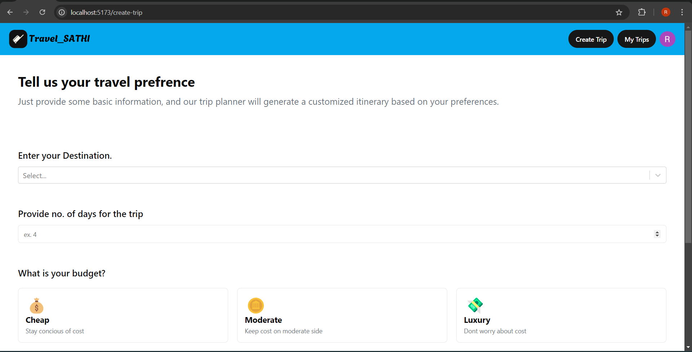

# 🌍 AI Travel Planner App

An intelligent travel planning application that simplifies your travel experience. The AI Travel Planner app uses modern technologies like React, Node.js, Express, Firebase, and integrates several APIs including the Gemini AI API and Google Maps API. This app allows users to create personalized travel itineraries, explore accommodations, and manage past trips.

## 🚀 Features

- **Frontend:** Built with React, styled using ShadCN.
- **Backend:** Powered by Node.js and Express for robust server-side operations.
- **Database:** Firebase for secure data storage and user authentication.
- **Google Authentication:** Implemented for easy and secure user login.
- **Travel Itinerary Creation:** Utilizes the Gemini AI API for crafting personalized travel itineraries.
- **Autocomplete Places:** Integrated with Google Maps API to suggest places as users type.
- **Dynamic Content:** Real-time fetching of hotel and day plan images via HTTP requests to Google.

## 📄 Pages

### 1. Home Page


The landing page of the app, welcoming users and providing a brief overview of the app's capabilities.



Sign In option with Google 



Google Authentication

### 2. Create Trip Page


This page allows users to customize their travel plans. Users can input preferences, dates, and locations, with real-time suggestions powered by the Google Maps API.

### 3. Itinerary Page


Here, users can view their detailed travel itineraries, including hotels, activities, and day plans. The images of hotels and activities are dynamically fetched from Google.

### 4. My Trips Page


This page lists all the previous trips the user has searched for or created, providing easy access to their past itineraries.

## 🛠️ Technologies Used

- **React:** Frontend library for building user interfaces.
- **Node.js & Express:** Backend runtime and framework for handling server-side operations.
- **Firebase:** Cloud platform used for user authentication and data storage.
- **ShadCN:** Utility-first styling framework used for consistent and responsive UI components.
- **Gemini AI API:** Utilized for generating travel itineraries.
- **Google Maps API:** For places autocomplete and fetching real-time images and locations.

## 🔧 Installation & Setup

1. **Clone the repository:**
   ```bash
   git clone https://github.com/octal-rajat311/Travel_SATHI.git
   cd Travel_SATHI
